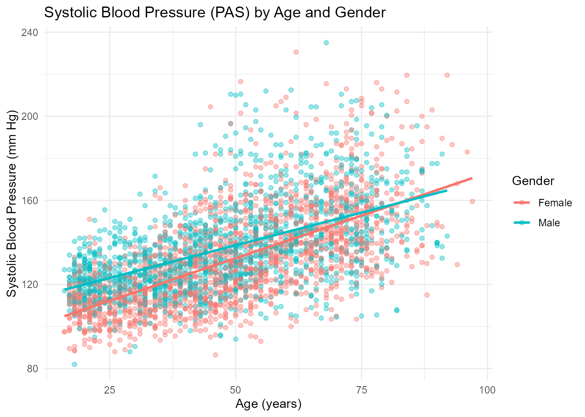

# ChileDataAPI: Access Chilean Data via APIs and Curated Datasets

``` r

library(ChileDataAPI)
library(ggplot2)
library(dplyr)
#> 
#> Attaching package: 'dplyr'
#> The following objects are masked from 'package:stats':
#> 
#>     filter, lag
#> The following objects are masked from 'package:base':
#> 
#>     intersect, setdiff, setequal, union
```

## Introduction

The `ChileDataAPI` package provides a unified interface to access open
data from multiple public RESTful APIs, including the *FINDIC API*, the
*World Bank API*, and *Nager.Date*. With a focus on Chile, the package
enables users to retrieve real-time or historical data such as financial
indicators (**UF, UTM, Dollar, Euro, Yen, Copper price per pound,
Bitcoin, IPSA index**), and holidays.

In addition to API-based data retrieval, `ChileDataAPI` includes a
curated collection of datasets that cover diverse aspects of Chilean
society and environment, such as human rights violations during the
Pinochet regime, electoral data, census samples, health surveys, seismic
events, territorial codes, and environmental measurements.

All API-based functions return data as tidy tibble objects, making them
ready for immediate use in data pipelines. For example, the financial
indicator functions
[`get_chile_dollar()`](https://lightbluetitan.github.io/chiledataapi/reference/get_chile_dollar.md),
[`get_chile_uf()`](https://lightbluetitan.github.io/chiledataapi/reference/get_chile_uf.md),
and
[`get_chile_bitcoin()`](https://lightbluetitan.github.io/chiledataapi/reference/get_chile_bitcoin.md)
provide reproducible time series of daily or monthly values, where each
row corresponds to a timestamped observation.

By combining high-quality curated datasets with open APIs,
`ChileDataAPI` offers a comprehensive toolkit for research and analysis
related to Chile, supporting work in economics, politics, demographics,
and environmental studies.

In addition to API-access functions, the package includes a collection
of curated datasets related to *Chile*, covering diverse topics such as:

- `Demographics`: sample microdata from the 2017 Chilean Census
- `Elections`: data from the 2021 presidential elections and national
  plebiscites
- `Public health`: individual-level records from national health surveys
- `Human rights`: detailed accounts of violations during the Pinochet
  regime
- `Seismology`: geolocated data on earthquakes in *Chile*
- `Geopolitical data`: official territorial codes for communes,
  provinces, and regions
- `Environmental history`: tree-ring based climate series from Malleco
  forest

`ChileDataAPI` is designed to support research, teaching, and data
analysis focused on *Chile* by integrating public RESTful APIs with
high-quality, domain-specific datasets into a single, easy-to-use R
package.

### Functions for ChileDataAPI

The `ChileDataAPI` package provides several core functions to access
real-time and structured information about Chile from public APIs such
as [FINDIC](https://findic.cl/), the [World Bank
API](https://datahelpdesk.worldbank.org/knowledgebase/articles/889392),
and [Nager.Date](https://date.nager.at/Api).

Below is a list of the main functions included in the package:

- [`get_chile_bitcoin()`](https://lightbluetitan.github.io/chiledataapi/reference/get_chile_bitcoin.md):
  Retrieves the daily Bitcoin price in Chilean Pesos over the last
  month.

- [`get_chile_copper_pound()`](https://lightbluetitan.github.io/chiledataapi/reference/get_chile_copper_pound.md):
  Returns historical daily copper prices (per pound).

- [`get_chile_dollar()`](https://lightbluetitan.github.io/chiledataapi/reference/get_chile_dollar.md):
  Provides the exchange rate of the U.S. Dollar in CLP.

- [`get_chile_euro()`](https://lightbluetitan.github.io/chiledataapi/reference/get_chile_euro.md):
  Provides the exchange rate of the Euro in CLP.

- [`get_chile_ipsa()`](https://lightbluetitan.github.io/chiledataapi/reference/get_chile_ipsa.md):
  Retrieves daily values of the IPSA (Chile’s stock market index).

- [`get_chile_uf()`](https://lightbluetitan.github.io/chiledataapi/reference/get_chile_uf.md):
  Returns daily values of the Unidad de Fomento (UF).

- [`get_chile_utm()`](https://lightbluetitan.github.io/chiledataapi/reference/get_chile_utm.md):
  Returns monthly values of the Unidad Tributaria Mensual (UTM).

- [`get_chile_yen()`](https://lightbluetitan.github.io/chiledataapi/reference/get_chile_yen.md):
  Provides the exchange rate of the Japanese Yen in CLP.

- [`get_chile_holidays()`](https://lightbluetitan.github.io/chiledataapi/reference/get_chile_holidays.md):
  Get official public holidays in chile for a given year, e.g.,
  `get_chile_holidays(2025)`.

- [`get_chile_child_mortality()`](https://lightbluetitan.github.io/chiledataapi/reference/get_chile_child_mortality.md):
  Get Chile’s Under-5 Mortality Rate data from the World Bank.

- [`get_chile_cpi()`](https://lightbluetitan.github.io/chiledataapi/reference/get_chile_cpi.md):
  Get Chile’s Consumer Price Index (2010 = 100) data from the World
  Bank.

- [`get_chile_energy_use()`](https://lightbluetitan.github.io/chiledataapi/reference/get_chile_energy_use.md):
  Get Chile’s Energy Use (kg of oil equivalent per capita) data from the
  World Bank.

- [`get_chile_gdp()`](https://lightbluetitan.github.io/chiledataapi/reference/get_chile_gdp.md):
  Get Chile’s GDP (current US\$) data from the World Bank.

- [`get_chile_hospital_beds()`](https://lightbluetitan.github.io/chiledataapi/reference/get_chile_hospital_beds.md):
  Get Chile’s Hospital Beds (per 1,000 people) data from the World Bank.

- [`get_chile_life_expectancy()`](https://lightbluetitan.github.io/chiledataapi/reference/get_chile_life_expectancy.md):
  Get Chile’s Life Expectancy at Birth data from the World Bank.

- [`get_chile_literacy_rate()`](https://lightbluetitan.github.io/chiledataapi/reference/get_chile_literacy_rate.md):
  Get Chile’s Adult Literacy Rate data from the World Bank.

- [`get_chile_population()`](https://lightbluetitan.github.io/chiledataapi/reference/get_chile_population.md):
  Get Chile’s Total Population data from the World Bank.

- [`get_chile_unemployment()`](https://lightbluetitan.github.io/chiledataapi/reference/get_chile_unemployment.md):
  Get Chile’s Total Unemployment Rate data from the World Bank.

- [`view_datasets_ChileDataAPI()`](https://lightbluetitan.github.io/chiledataapi/reference/view_datasets_ChileDataAPI.md):
  Lists all curated datasets included in the `ChileDataAPI` package

These functions return real-time data in tidy `tibble` format and
represent **time series** that are updated daily or monthly depending on
the source.

The functions powered by the [FINDIC](https://findic.cl/) endpoints
provide economic time series such as the **UF, UTM, Dollar, Euro, Yen,
Copper price per pound, Bitcoin, and the IPSA index**.

In addition, functions connected to the [World Bank
API](https://datahelpdesk.worldbank.org/knowledgebase/articles/889392)
supply structured information on **macroeconomic indicators (GDP, CPI,
unemployment, energy use, hospital beds)**, **population trends**,
**life expectancy**, **literacy rates**, and other development
indicators for Chile.

All outputs are delivered as tidy `tibble` objects, making them ready
for immediate integration into reproducible analytical workflows.

These functions allow users to access high-quality and structured
information on `Chile`, which can be combined with tools like `dplyr`,
`tidyr`, and `ggplot2` to support a wide range of data analysis and
visualization tasks. In the following sections, you’ll find examples on
how to work with `ChileDataAPI` in practical scenarios.

#### Get Observed Copper Price per Pound

``` r


chile_copper_price <- head(get_chile_copper_pound(),n=10)

print(chile_copper_price)
#> # A tibble: 10 × 2
#>    fecha      valor
#>    <chr>      <dbl>
#>  1 2026-07-02  6.06
#>  2 2026-07-01  6.01
#>  3 2026-06-30  6   
#>  4 2026-06-26  5.91
#>  5 2026-06-25  6.03
#>  6 2026-06-24  6.16
#>  7 2026-06-23  6.14
#>  8 2026-06-22  6.18
#>  9 2026-06-19  6.24
#> 10 2026-06-18  6.21
```

#### Get exchange rate of the U.S. Dollar in CLP

``` r


chile_dollar_price <- head(get_chile_dollar(),n=10)

print(chile_dollar_price)
#> # A tibble: 10 × 2
#>    fecha      valor
#>    <chr>      <dbl>
#>  1 2026-07-02  927.
#>  2 2026-07-01  922.
#>  3 2026-06-30  922.
#>  4 2026-06-26  917.
#>  5 2026-06-25  921.
#>  6 2026-06-24  916.
#>  7 2026-06-23  906.
#>  8 2026-06-22  901.
#>  9 2026-06-19  897.
#> 10 2026-06-18  883.
```

#### Get exchange rate of the Euro in CLP.

``` r


chile_euro_price <- head(get_chile_euro(),n=10)

print(chile_euro_price)
#> # A tibble: 10 × 2
#>    fecha      valor
#>    <chr>      <dbl>
#>  1 2026-07-02 1055.
#>  2 2026-07-01 1053.
#>  3 2026-06-30 1050.
#>  4 2026-06-26 1043.
#>  5 2026-06-25 1046.
#>  6 2026-06-24 1042.
#>  7 2026-06-23 1035.
#>  8 2026-06-22 1034.
#>  9 2026-06-19 1028.
#> 10 2026-06-18 1020.
```

#### Chile’s GDP (Current US\$) from World Bank 2022 - 2017

``` r


chile_gdp <- head(get_chile_gdp())

print(chile_gdp)
#> # A tibble: 6 × 5
#>   indicator         country  year         value value_label    
#>   <chr>             <chr>   <int>         <dbl> <chr>          
#> 1 GDP (current US$) Chile    2022 301099244104. 301,099,244,104
#> 2 GDP (current US$) Chile    2021 315507493783. 315,507,493,783
#> 3 GDP (current US$) Chile    2020 254103710483. 254,103,710,483
#> 4 GDP (current US$) Chile    2019 278308438545. 278,308,438,545
#> 5 GDP (current US$) Chile    2018 295857562992. 295,857,562,992
#> 6 GDP (current US$) Chile    2017 276154259981. 276,154,259,981
```

#### Chile’s Life Expectancy at Birth from World Bank 2022 - 2017

``` r


chile_life_expectancy <- head(get_chile_life_expectancy())

print(chile_life_expectancy)
#> # A tibble: 6 × 4
#>   indicator                               country  year value
#>   <chr>                                   <chr>   <int> <dbl>
#> 1 Life expectancy at birth, total (years) Chile    2022  79.2
#> 2 Life expectancy at birth, total (years) Chile    2021  78.9
#> 3 Life expectancy at birth, total (years) Chile    2020  79.3
#> 4 Life expectancy at birth, total (years) Chile    2019  80.3
#> 5 Life expectancy at birth, total (years) Chile    2018  80.6
#> 6 Life expectancy at birth, total (years) Chile    2017  80.6
```

#### Systolic Blood Pressure by Age and Gender

``` r


# Clean data: remove missing values from key variables
health_clean <- chile_health_survey_df %>%
  filter(!is.na(age), !is.na(pas), !is.na(male))

# Create gender variable
health_clean <- health_clean %>%
  mutate(gender = ifelse(male == 1, "Male", "Female"))

# Plot: Systolic Blood Pressure vs Age by Gender
ggplot(health_clean, aes(x = age, y = pas, color = gender)) +
  geom_point(alpha = 0.4) +
  geom_smooth(method = "lm", se = FALSE) +
  labs(
    title = "Systolic Blood Pressure (PAS) by Age and Gender",
    x = "Age (years)",
    y = "Systolic Blood Pressure (mm Hg)",
    color = "Gender"
  ) +
  theme_minimal()
```



### Dataset Suffixes

Each dataset in `ChileDataAPI` is labeled with a *suffix* to indicate
its structure and type:

- `_df`: A standard data frame.

- `_ts`: A time series object.

- `_tbl_df`: A tibble data frame object.

### Datasets Included in ChileDataAPI

In addition to API access functions, `ChileDataAPI` provides several
curated datasets offering valuable insights into *Chile*’s recent
history, population health, territorial divisions, electoral processes,
and seismic activity. Here are some featured examples:

- `census_chile_2017_df`: Data frame containing microdata from the 2017
  Chilean census, specifically from the commune of San Pablo. The
  dataset includes 7,512 observations, all variable names and data
  values are in Spanish.

- `chile_earthquakes_tbl_df`: Tibble containing information about
  significant (perceptible) earthquakes that occurred in Chile from
  January 1st, 2012 to the present.

- `malleco_tree_rings_ts`: Time series object (`ts`) containing the
  average annual tree ring width, measured in millimeters, for Araucaria
  Araucana trees located in the Malleco region of Chile.

### Conclusion

The `ChileDataAPI` package provides a robust set of tools to access open
data about *Chile* through *RESTful APIs* and curated datasets. It
includes functions to retrieve real-time financial indicators—such as
the value of the dollar, euro, yen, copper, UF, UTM, and Bitcoin—via the
*FINDIC API*.

In addition, the package integrates with the *World Bank API* to deliver
structured macroeconomic and demographic indicators, including **GDP,
CPI, unemployment, energy use, hospital beds, population, life
expectancy, and literacy rates**, enabling comprehensive socio-economic
analysis.

Through the *Nager.Date API*, users can access official **Chilean public
holidays**, which facilitates temporal alignment of datasets with
policy, economic, and cultural events.

Beyond APIs, the package also offers curated datasets covering *Chile*’s
recent history and socio-political context, including the **2017 census
sample, the 2021 presidential election, public health survey data,
territorial codes, seismic events, and records of human rights
violations during the Pinochet regime**.

By combining real-time API calls with high-quality curated datasets,
`ChileDataAPI` enables reproducible research and in-depth analysis of
Chile’s economic, demographic, environmental, and political landscape.
