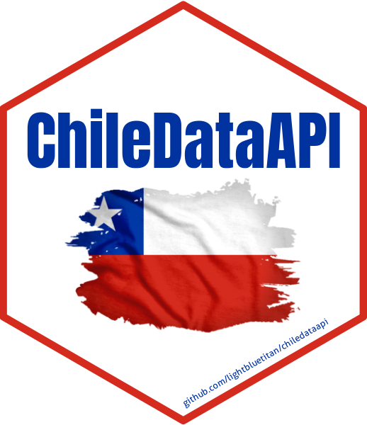

# ChileDataAPI: Access Chilean Data via APIs and Curated Datasets

This package provides functions to access data from public RESTful APIs
including 'FINDIC API', 'REST Countries API', 'World Bank API', and
'Nager.Date', retrieving real-time or historical data related to Chile
such as financial indicators, holidays, international demographic and
geopolitical indicators, and more. Additionally, the package includes
curated datasets related to Chile, covering topics such as human rights
violations during the Pinochet regime, electoral data, census samples,
health surveys, seismic events, territorial codes, and environmental
measurements..

## Details

ChileDataAPI: Access Chilean Data via APIs and Curated Datasets

Access Chilean Data via APIs and Curated Datasets.

## See also

Useful links:

- <https://github.com/lightbluetitan/chiledataapi>

## Author

**Maintainer**: Renzo Caceres Rossi <arenzocaceresrossi@gmail.com>
